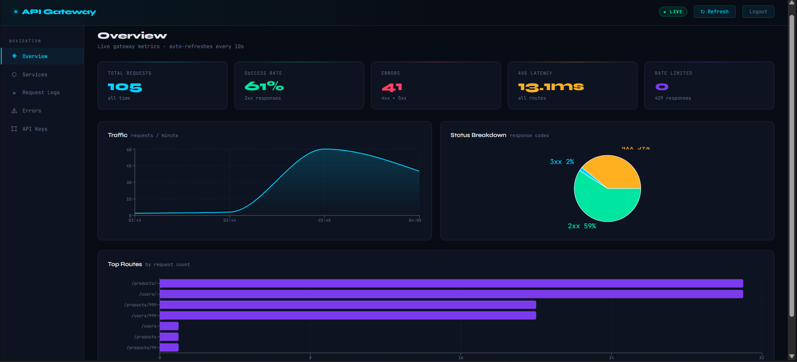
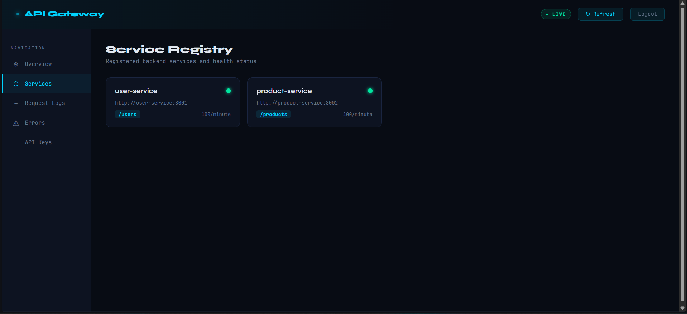
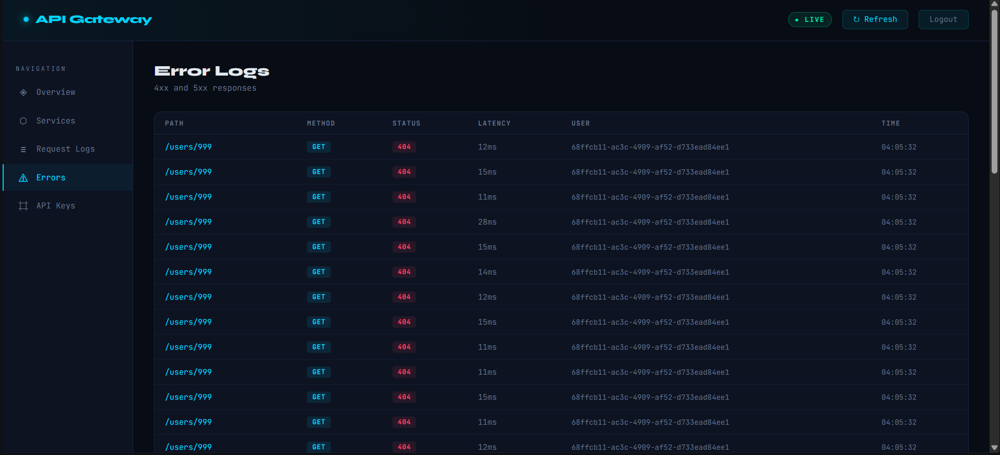
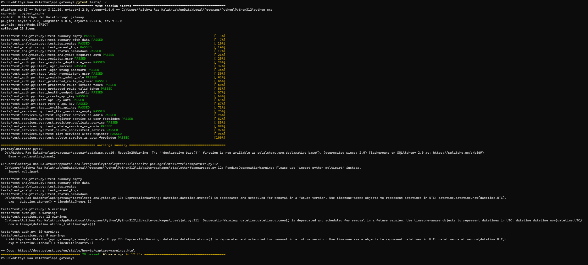

# Microservice Traffic Management Platform

[](https://github.com/AdithyaRaoK14/API-Gateway/actions/workflows/ci.yml)
[](https://www.python.org/)
[](https://fastapi.tiangolo.com/)
[](https://react.dev/)
[](https://redis.io/)
[](https://www.docker.com/)
[](https://www.postgresql.org/)
[](./tests)

A self-hosted API Gateway with JWT authentication, API key support, Redis sliding-window rate limiting, dynamic service routing, automated health checks, and a live React dashboard.



---

## Architecture

```
                    ┌─────────────────────────────────────┐
                    │          API Gateway :8000           │
                    │                                      │
Client ─────────────►  Auth MW (JWT / X-API-Key)          │
                    │       ↓                              │
                    │  Rate Limit MW (Redis)               │
                    │       ↓                              │
                    │  Route Resolver (PostgreSQL)         │
                    └────────┬───────────────┬────────────┘
                             │               │
                     ┌───────▼───┐   ┌───────▼──────┐
                     │  User     │   │  Product     │
                     │  Service  │   │  Service     │
                     │  :8001    │   │  :8002       │
                     └───────────┘   └──────────────┘

  Dashboard :3000 ──► Analytics API ──► PostgreSQL
```

---

## Features

| Feature | Detail |
|---|---|
| **Request Routing** | Register backend services with URL prefix mapping; resolved dynamically per request |
| **Dual Authentication** | JWT Bearer tokens **and** `X-API-Key` header; API keys SHA-256 hashed in PostgreSQL |
| **Rate Limiting** | Redis sliding-window; 100 req/min per user/IP; `X-RateLimit-*` response headers |
| **Health Checks** | Background async ping every 30s; unhealthy services auto-excluded from routing |
| **Request Logging** | Every proxied request logged to PostgreSQL — path, method, status, latency, user |
| **Analytics API** | 7 endpoints: summary, traffic, top routes, errors, status breakdown, service health |
| **React Dashboard** | Live charts, service health cards, request log table, API key manager |
| **Role-Based Access** | `admin` role for service management; `user` role for proxy access |
| **CI/CD** | GitHub Actions: pytest suite → Docker build on every push |

---

## Screenshots

### Dashboard — Overview
Traffic area chart, status code pie chart, top routes bar chart, live stat cards.


### Dashboard — Service Registry
Health status cards for each registered backend service.



### Dashboard — Request Logs
Full request table with method badges, colored status codes, latency, and user tracking.


### Dashboard — Error Logs
Filtered view of 4xx and 5xx responses only.



### Dashboard — API Key Manager
Generate hashed API keys, list active keys with prefix preview, revoke on demand.


### Rate Limiter in Action
429 responses when a user exceeds 100 requests/minute.


### Swagger API Docs
Auto-generated OpenAPI documentation at `/docs`.


### Test Suite — 28 Passing
Full pytest integration suite covering auth, services, and analytics.



---

## Quick Start

### Prerequisites
- Docker Desktop for Windows
- Git

### Run everything

```powershell
git clone https://github.com/AdithyaRaoK14/API-Gateway.git
cd API-Gateway
docker compose up --build
```

| Service | URL |
|---|---|
| API Gateway | http://localhost:8000 |
| Dashboard | http://localhost:3000 |
| Swagger Docs | http://localhost:8000/docs |
| User Service | http://localhost:8001 |
| Product Service | http://localhost:8002 |

---

## Usage

### 1. Register an admin user

```powershell
curl -X POST http://localhost:8000/auth/register `
  -H "Content-Type: application/json" `
  -d '{"username": "admin", "password": "secret", "role": "admin"}'
```

### 2. Login and save token

```powershell
$TOKEN = (curl -s -X POST http://localhost:8000/auth/login `
  -H "Content-Type: application/json" `
  -d '{"username": "admin", "password": "secret"}' | ConvertFrom-Json).token
```

### 3. Register backend services

```powershell
curl -X POST http://localhost:8000/services/ `
  -H "Authorization: Bearer $TOKEN" `
  -H "Content-Type: application/json" `
  -d '{"name": "user-service", "url": "http://user-service:8001", "prefix": "users"}'

curl -X POST http://localhost:8000/services/ `
  -H "Authorization: Bearer $TOKEN" `
  -H "Content-Type: application/json" `
  -d '{"name": "product-service", "url": "http://product-service:8002", "prefix": "products"}'
```

### 4. Proxy requests through the gateway

```powershell
# Using JWT
curl http://localhost:8000/api/users/ -H "Authorization: Bearer $TOKEN"

# Using API Key
curl http://localhost:8000/api/products/ -H "X-API-Key: gw_your_key_here"
```

### 5. Trigger rate limiting (send 110 requests quickly)

```powershell
1..110 | ForEach-Object {
  $code = (curl -s -o NUL -w "%{http_code}" http://localhost:8000/api/users/ -H "Authorization: Bearer $TOKEN")
  Write-Host $code
}
```

### 6. Check analytics

```powershell
curl http://localhost:8000/analytics/summary    -H "Authorization: Bearer $TOKEN"
curl http://localhost:8000/analytics/top-routes -H "Authorization: Bearer $TOKEN"
curl http://localhost:8000/analytics/errors     -H "Authorization: Bearer $TOKEN"
curl http://localhost:8000/analytics/traffic    -H "Authorization: Bearer $TOKEN"
```

---

## API Reference

### Auth
| Method | Endpoint | Auth | Description |
|---|---|---|---|
| POST | `/auth/register` | Public | Register user (`role`: `user` or `admin`) |
| POST | `/auth/login` | Public | Login → JWT token |

### Services
| Method | Endpoint | Auth | Description |
|---|---|---|---|
| GET | `/services/` | Any | List all registered services |
| POST | `/services/` | Admin | Register a backend service |
| DELETE | `/services/{name}` | Admin | Deregister a service |

### Proxy
| Method | Endpoint | Auth | Description |
|---|---|---|---|
| ANY | `/api/{path}` | Any | Proxy to resolved backend service |

### Analytics
| Method | Endpoint | Description |
|---|---|---|
| GET | `/analytics/summary` | Total requests, errors, avg latency, rate limit hits |
| GET | `/analytics/traffic` | Requests per minute for the last hour |
| GET | `/analytics/top-routes` | Top 10 paths by request count |
| GET | `/analytics/errors` | Last 50 error responses (4xx/5xx) |
| GET | `/analytics/recent` | Last 50 requests |
| GET | `/analytics/status-breakdown` | Request count grouped by status code |
| GET | `/analytics/services-health` | Health status of all registered services |

### API Keys
| Method | Endpoint | Description |
|---|---|---|
| POST | `/api-keys/` | Generate a new API key (shown once) |
| GET | `/api-keys/` | List your active keys |
| DELETE | `/api-keys/{id}` | Revoke a key |

---

## Running Tests

```powershell
pip install -r requirements.txt
pytest tests/ -v
```

Tests use SQLite — no Redis or PostgreSQL needed locally.

---

## CI/CD

GitHub Actions runs on every push to `main` and `develop`:

1. **Test job** — installs dependencies, runs `pytest tests/ -v`
2. **Docker job** — builds the gateway image, validates `docker compose config`

See [`.github/workflows/ci.yml`](.github/workflows/ci.yml).

---

## Tech Stack

| Layer | Technology |
|---|---|
| Gateway | FastAPI, Uvicorn, Python 3.11 |
| Authentication | python-jose (JWT), passlib, SHA-256 hashed API keys |
| Rate Limiting | Redis 7, sliding-window algorithm |
| Database | PostgreSQL 15, SQLAlchemy 2 |
| Proxy | httpx (async HTTP client) |
| Dashboard | React 18, Recharts |
| DevOps | Docker Compose, GitHub Actions |
| Testing | pytest, FastAPI TestClient, SQLite |
